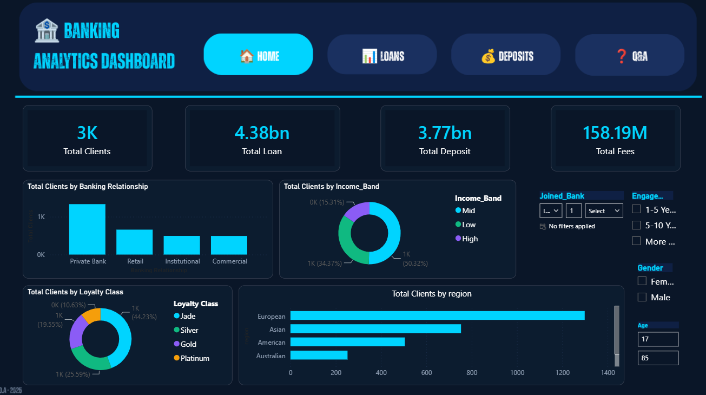

**Banking Analytics** 

A Power BI dashboard built on 3,000 banking clients, covering credit risk, lending, deposits, and client retention. Pages are linked by the navigation bar; every page can be filtered by join year, time with the bank, gender, and age.

EDA in Python, loaded and stored in a MySQL database, modelled it as a star schema in Power BI, and published the finished 4-page report to Power BI Service, where it can be accessed using the link.

**View the 4-page report and live dashboard on Power BI Service** - [LINK](https://app.powerbi.com/view?r=eyJrIjoiZWQ1NjBjNGQtYmZkZC00YjE3LWFjMWYtOGM5ZDc5YTRkNzU3IiwidCI6ImU1ZWFlNDA1LWJhMTUtNDA0Yy05MTA2LWRkNGRhNzlhOWNjNiJ9) 

##
Data: 3,000 clients, 25 columns (demographics, deposits, loans, fees and risk rating)
Tools: Python, MySQL, Power BI, DAX, Canva, Power BI Service

**??** 

What I wanted to find out.
Which client groups carry the most credit risk, and how does that risk vary by region and income?
Where are the cross-sell opportunities, for example clients with loans but no deposits?
Which clients have both bank loans and business lending, and how much is that exposure worth?
How does income relate to borrowing and to the fees the bank earns?
How long do clients stay with the bank, and which groups stay the longest?
How it fits together

Banking.csv  →  Python (Jupyter)  →  MySQL  →  Power BI  →  Power BI Service

##

Clean the data with Python. MySQL gives it a proper structure that can be queried. Power BI turns it into something a business user can explore without writing any code.

**1. EDA the data in Python. Stack: Pandas, NumPy, Matplotlib, Seaborn, Jupyter.**

I checked and confirmed all 25 features. 
I converted Joined Bank to a standard date format (YYYY-MM-DD) so MySQL and Power BI would both read it as a date.
I then added an Income Band column based on estimated income:

Band	Estimated income	Clients:
Low	up to 100,000	1,027
Mid	100,000 to 300,000	1,517
High	over 300,000	456

The client base splits like this:
Region	Clients		Loyalty class	Clients
European	1,309		Jade	1,331
Asian	754		Silver	767
American	507		Gold	585
Australian	254		Platinum	317
African	176			

To see how the main financial columns relate to each other, I plotted seven pairs with regression lines:
Bank deposits vs savings accounts
Checking accounts vs savings accounts
Checking accounts vs foreign currency accounts
Age vs superannuation savings
Estimated income vs checking accounts
Bank loans vs credit card balance
Business lending vs bank loans

*A few things stood out. Business lending moves closely with bank loans, so the clients who borrow most are also the ones using business credit. Income has only a weak link to checking account balances. Age has almost no link to superannuation savings. These results shaped what I put on the dashboard: lending, risk by client group, and deposit behaviour.*

##

**2. Building the MySQL database. Stack: MySQL Workbench, SQL, mysql-connector-python**

I created a schema called banking_case with a clients_banking table, using client_id as the primary key. I loaded the 3,000 rows from the notebook with mysql-connector-python, using INSERT IGNORE so that running the load twice won't create duplicate clients.

To confirm there were no duplicate IDs, I ran this check, which returned no rows:

sql
SELECT client_id, COUNT(*)
FROM clients_banking
GROUP BY client_id
HAVING COUNT(*) > 1;

##

**3. Data model  and DAX in Power BI**
Stack: Power BI Desktop, Power Query, MySQL connector

Power BI connects straight to the MySQL database, so a refresh picks up any changes without exporting files by hand.

I set the tables up as a star schema. bankingx is the fact table, with one row per client. It links to three dimension tables: gender (GenderId), investment advisors (IAId) and banking relationships (BRId). Each relationship is one-to-many and filters from the dimension to the fact table, so one slicer updates every visual on the page.

The main DAX measures use:

SUMX for loan and deposit totals
DISTINCTCOUNT for client counts
CALCULATE with FILTER for groups such as high-risk clients (risk rating 4 or 5)
DATEDIFF for how long each client has been with the bank
SWITCH for grouping clients into engagement bands

##

**4. Designing the layout in Canva**

Before building anything in Power BI, I designed the pages in Canva: the dark navy theme, the navigation buttons (Home, Loans, Deposits, Q&A), where the KPI cards sit, and the grid. The canvas is 1280 × 720, the same size as a Power BI page, so I could export each design and use it as the page background.

##

**5. Data Explorer**

A decomposition tree, so you can break the 4.38bn loan total down any way you like, for example by region, then occupation, then risk rating.

Region	Total loans
European	1.94bn
Asian	1.08bn
American	730M
Australian	382M
African	about 0.25bn (the rest of the 4.38bn)

##

**Key Findings
The total loan portfolio across 3K clients stands at 4.38bn, with European clients carrying the largest share by region at 1.94bn.
482 clients were flagged as high risk — a segment that shows a rising trend in the years approaching 2020, warranting closer monitoring from investment advisors.
Business lending of 2.60bn exceeds bank loans of 1.77bn, with a sharp upward trend in business lending visible in the time-series chart from 2015 onwards.
The deposit portfolio totals 801.24M, with bank deposits making up the largest share at 424M and foreign currency holdings the smallest at 19.60M.
The majority of clients sit in the mid income band, which also accounts for the largest share of total loan uptake across the portfolio.
Engagement timeframe data shows that the largest portion of the client base has been with the bank for more than 10 years, indicating strong retention in the core portfolio.**

---
Skills
Python · Pandas · Matplotlib · Seaborn · Jupyter Notebook · MySQL · SQL · Multi-Table Joins · Relational Schema Design · Data Cleaning · Exploratory Data Analysis · Power BI · DAX · Star Schema · Data Modelling · Power Query · KPI Dashboard Design · Canva Design · Business Intelligence · Data Storytelling · Power BI Service

---

## Connect:

OLAMIDE AKANNI | Data Sci. | BI

---

Feedback welcome!
